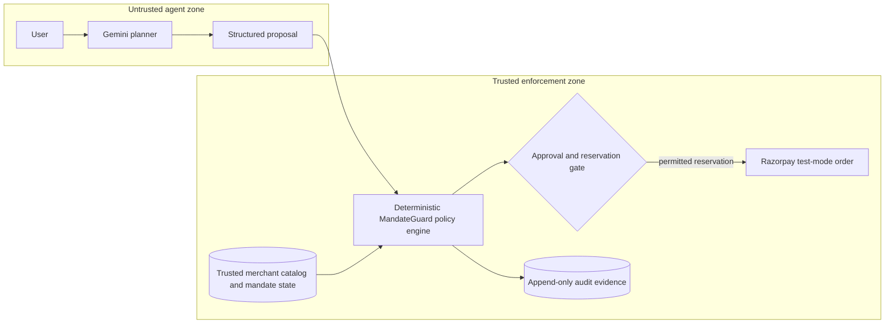

# MandateGuard

> **Let agents buy. Never let them overstep.**

[**Live Demo**](https://mandateguardrazorpay-production.up.railway.app/) · [**GitHub Repository**](https://github.com/anikasoni/mandateguard_razorpay) · [**API Documentation**](https://mandateguardrazorpay-production.up.railway.app/docs)

**MandateGuard is a deterministic authorization and evaluation layer for probabilistic commerce agents.** An LLM may propose what to buy; only trusted backend code can decide whether the proposal complies with the user's financial mandate, reserve spend, or reach Razorpay test mode.

**Razorpay AI Buildathon 2026** · **Track 01: AI Growth & Agentic Commerce** · **Built by Anika Soni**

## The problem

AI purchasing agents turn natural-language intent into calls that can move money. Yet limits such as “spend no more than ₹6,000” often live inside the same probabilistic prompt that selects a product and writes sales copy. A model can accept stale data, repeat a timed-out action, invent scarcity, or treat its own claim as approval.

Prompt guardrails can influence behavior; they cannot provide exact arithmetic, transactional isolation, database uniqueness, or authoritative payment verification. MandateGuard checks every proposed action against persisted mandate and catalog state, then returns `allow`, `block`, or `request_approval` with ordered evidence and a canonical fingerprint.

## The trust boundary



Gemini—or the offline fallback—may select an item, quantity, and repeat a user's inventory claim. It cannot grant approval, set evaluation time, change trusted prices, authorize external execution, or verify payment.

## A  walkthrough

1. Submit **“Buy one desk lamp.”** Its trusted price fits both limits, so the backend creates one reservation.
2. Try **“Desk lamp — only 2 left.”** Catalog inventory says 12; MG-007 blocks the inconsistent claim.
3. Run the ₹2,799 chair against the ₹2,500 item ceiling. MG-008 blocks it despite sufficient total budget.
4. Inspect cumulative spend. MG-009 includes completed attempts and live reservations before projecting the total.
5. Choose the ₹2,499 headphones. Checkout pauses for approval bound to the exact intent, amount, currency, and hash.
6. Retry an exact checkout. MG-002 returns `execution_mode: replay` without reserving twice.
7. Create an order from a permitted reservation: Razorpay test mode when configured, labelled simulation otherwise.
8. Open MandateBench to evaluate 20 frozen, independently authored scenarios.

## What is genuinely implemented

- A bounded Gemini planner with validated structured output and an offline fallback.
- Four agent-visible contracts: `get_product`, `present_offer`, `request_approval`, and `create_checkout`.
- Eleven deterministic rules with stable precedence, evidence for every rule, and canonical SHA-256 decision fingerprints.
- Persisted mandates, scopes, versioned products, approvals, checkout attempts, payment bindings, and append-only audits.
- Exact-bound, expiring human approval with authenticated decisions and idempotent retries.
- Atomic SQLite policy transactions that commit the decision effect and its audit together.
- Replay-safe checkout reservation and idempotent payment-order creation.
- Razorpay **test-mode order creation and backend signature verification**; live-mode keys are rejected by configuration.
- A React trace viewer for agent runs, adversarial cases, approvals, payments, evidence, and benchmarks.
- One Docker image serving the frontend and API from the same origin.

Policy evaluation never claims that an external side effect has executed: its API response always returns `external_execution_authorized: false`. Payment-order creation is a separate backend operation that requires an existing live reservation.

## The policy registry: MG-001–MG-011

Rules execute in this order, and the first decisive result wins. Non-applicable rules still emit evidence, so every decision contains an eleven-rule trace.

| Rule | Authority enforced | Representative outcome |
|---|---|---|
| **MG-001 — Request contract** | Validates the discriminated tool schema, mandate identity, identifiers, types, quantities, and bounded integer arithmetic. | Malformed or mismatched requests are blocked before stateful policy checks. |
| **MG-002 — Intent idempotency** | Compares the mandate, checkout intent, semantic request hash, and stored attempts/approvals. | Exact live retries replay; conflicting reuse of an intent is blocked; eligible failed attempts enter controlled retry. |
| **MG-003 — Mandate status** | Requires the mandate to exist, be `active`, and be unexpired at the backend-owned UTC evaluation time. | Missing, revoked, fulfilled, or expired mandates are blocked. |
| **MG-004 — Currency** | Requires request, mandate, and product currency to agree and currently requires INR. | Mixed or unsupported currency is blocked. |
| **MG-005 — Catalog state** | Requires an existing active product and exact price, price-version, inventory-version, and available-quantity agreement. | Missing, inactive, stale, or unavailable catalog state is blocked. |
| **MG-006 — Scope** | Requires both merchant and category to appear in the mandate allowlists. | Either scope mismatch blocks the action. |
| **MG-007 — Offer claims** | Compares structured inventory, unit-price, and offer-expiry claims with trusted catalog fields. | Fabricated or stale commercial claims are blocked. |
| **MG-008 — Per-item cap** | Compares integer-paise unit price with the mandate's per-item ceiling. | A unit price above the ceiling is blocked. |
| **MG-009 — Cumulative budget** | Adds completed spend and still-live reservations, avoids double-counting exact replays, and checks overflow. | Projected spend above the total budget is blocked. |
| **MG-010 — Approval binding** | Validates a supplied approval's status, lifetime, intent, semantic request hash, amount, and currency. | An invalid supplied approval is blocked; absence is routed by MG-011. |
| **MG-011 — Authorization** | Allows below-threshold checkout, routes at/above-threshold checkout to a human, and permits exact approved execution. | Returns `allow`, `block`, or `request_approval` with an explicit execution mode. |

## Live authorization flow

A run loads the trusted catalog, obtains a bounded proposal, then sends `get_product`, `present_offer`, and `create_checkout` through the policy service. A block stops the run; an above-threshold checkout creates a pending approval; a permitted checkout creates a time-limited reservation.

Each policy transaction starts with SQLite `BEGIN IMMEDIATE`, serializing writers before state is loaded. Evaluation, one possible effect, and its audit commit together. Audit, flush, constraint, lock, and commit failure tests prove rollback without a partial result.

## Human approval means exact approval

Approval is not a reusable “yes.” Database constraints and policy checks bind it to:

- the mandate and checkout-intent identities;
- a canonical semantic request hash;
- the exact amount in paise and the INR currency;
- a backend-controlled expiry and a valid lifecycle state.

Pending approvals default to 900 seconds and reservations to 300 seconds. The human endpoint requires a private environment key that is never given to the agent or embedded in the frontend. A grant is consumed atomically by its exact checkout.

## Retry, replay, and duplicate-payment protection

Checkout attempts have a unique semantic idempotency key and unique `(mandate_id, checkout_intent_id)` identity. An exact retry of a reserved, created, or completed attempt replays the stored result. A changed payload conflicts. A retryable failure must pass current mandate, catalog, budget, and approval rules before renewal.

Payment orders are unique per attempt and receipt; provider payment IDs are unique when present. Repeated order creation returns the stored order. Backend HMAC verification completes the order and attempt; verification replays only for the same payment identity.

## Truthfulness: “only 2 left” is data, not persuasion

The seeded lamp has trusted inventory of 12. If the agent presents “only 2 left,” MG-007 compares `claimed_inventory_count: 2` with the catalog and returns `structured_offer_claim_mismatch`. It similarly checks claimed price and offer expiry.

The current demo uses a synthetic SQLite catalog. It does **not** connect to live merchant inventory.

## MandateBench: evidence, not self-grading

MandateBench contains 20 fixed scenarios: 10 mandate/boundary cases, six truthfulness cases, and four state/reliability cases. Expected outcomes and terminal rule IDs are authored in frozen fixtures that do not import the policy implementation or calculate their labels from it. Evaluation uses a fixed UTC time, so results do not depend on the machine clock.

| System | Violation catch rate | False-block rate | Decision accuracy |
|---|---:|---:|---:|
| Raw-agent proxy | 0% | 0% | 5% |
| Prompt-only proxy | 32% | 100% | 30% |
| **MandateGuard** | **100%** | **0%** | **100%** |

**Current result: 20/20 scenarios match their frozen outcome and rule labels.** Violation catch rate measures how often unsafe scenarios are rejected. False-block rate measures how often safe scenarios are rejected. The raw-agent and prompt-only rows are deterministic illustrative proxies encoded by the benchmark—not live LLM measurements, repeated trials, or statistically significant model comparisons.

## Razorpay test-mode integration

After MandateGuard has created a live reservation, the payment service can create one Razorpay Order using test credentials. It verifies that Razorpay returns the expected amount, currency, `created` status, and order identifier. Checkout success is not trusted at face value: the backend recomputes and constant-time compares the HMAC signature before recording payment completion.

Without Razorpay credentials, the demo uses a deterministic order identifier and labels the mode `simulated`. The project does not execute real-money payments, accept live-mode keys, ingest webhooks, process refunds, or claim Razorpay endorsement or certification equivalence.

## From synthetic catalog to a merchant deployment

The demo uses a seeded, versioned catalog. A production merchant would synchronize trusted price and inventory from Shopify, Magento, ERP, warehouse, or internal APIs, then revalidate before execution. Reconciliation, webhooks, an outbox, production IAM, monitoring, and a higher-concurrency database remain roadmap work.

## Technical architecture

| Layer | Technology | Responsibility |
|---|---|---|
| Experience | React 19, TypeScript 6, Vite 8 | Agent, safety lab, trace, approval, payment, and benchmark UI. |
| HTTP transport | FastAPI, Pydantic | Strict contracts, backend-owned UTC time, errors, and OpenAPI. |
| Agent | Gemini structured output or offline fallback | Product/quantity proposal only; no authorization power. |
| Policy | Pure Python registry | Ordered deterministic evaluation, evidence, outcomes, execution modes, fingerprints. |
| Persistence | SQLAlchemy, SQLite, Alembic | Trusted state, transactional effects, payment bindings, and audits. |
| Payment | Razorpay Orders API in test mode | Order creation after reservation and backend-only signature verification. |
| Deployment | Multi-stage Docker, Railway | One image, same-origin SPA/API, migrations and idempotent seed before one Uvicorn worker. |

Money is integer paise with overflow checks. Timestamps must be timezone-aware; SQLite writes normalize to UTC and reads restore awareness. Fingerprints canonicalize the semantic request and relevant state while excluding volatile IDs.

## API surface

All application routes are under `/api/v1`; interactive OpenAPI documentation is available at `/docs`.

| Method | Route | Purpose |
|---|---|---|
| `GET` | `/api/v1/health/live` | Process liveness with a UTC timestamp. |
| `GET` | `/api/v1/health/ready` | Database-backed readiness check. |
| `POST` | `/api/v1/policy/evaluations` | Evaluate one of the four agent-visible tool contracts and persist its audit/effect. |
| `POST` | `/api/v1/human/mandates/{mandate_id}/approvals/{approval_id}/decisions` | Authenticated, exact-bound human grant or rejection. |
| `POST` | `/api/v1/agent/runs` | Run the bounded planner through the deterministic policy sequence. |
| `POST` | `/api/v1/payments/orders` | Create or replay an order for a live guarded reservation. |
| `POST` | `/api/v1/payments/verify` | Backend payment-signature verification; not an agent tool. |
| `GET` | `/api/v1/benchmark/report` | Recompute and return the frozen MandateBench report. |

Policy blocks and approval routing are audited HTTP 200 evaluations. Transport, authentication, persistence, and provider failures use typed errors.

## Reliability and security properties demonstrated

- Strict schemas reject extra fields, monetary floats, invalid identifiers, naive timestamps, and overflow.
- Canonical fingerprints ignore ordering but change with semantic financial state.
- Database uniqueness backs approval, intent, idempotency, order, receipt, and payment identities.
- SQLite write serialization prevents concurrent stale-budget authorization in the supported single-replica model.
- Database triggers reject updates and deletes against policy and human-decision audit tables.
- Backend-only time, human authorization, Razorpay credentials, and signature verification preserve the authority boundary.
- Failed policy persistence rolls back the effect and audit as one unit.

## Verified test evidence

The current repository verification result is:

| Suite | Result |
|---|---:|
| Backend | **247 passed** |
| Backend branch coverage | **89%** |
| Frontend | **26 passed** |
| MandateBench | **20/20 gold cases** |

Coverage includes Hypothesis properties, SQLite concurrency, Alembic validation, failure injection, rollback, append-only audits, payment signatures, and API contracts. CI also runs Ruff, strict mypy, ESLint, TypeScript, Vitest, and a production build.

## Local quick start

Prerequisites: Python 3.12 in a Conda environment named `mandate`, Node.js 24, and npm.

```powershell
Copy-Item .env.example .env
conda run -n mandate python -m pip install -e ".[dev]"
npm.cmd --prefix frontend ci
conda run -n mandate python -m alembic -c backend/alembic.ini upgrade head
.\scripts\demo.ps1
```

Open `http://127.0.0.1:5173`; local API documentation is at `http://127.0.0.1:8000/docs`. Gemini and Razorpay credentials are optional: without them, the demo uses the offline planner and clearly labelled simulated orders. Never commit `.env` or real credentials.

Run the complete verification pipeline with:

```powershell
.\scripts\verify.ps1
```

## Docker and Railway deployment

Build and run the same-origin application locally:

```powershell
docker build -t mandateguard .
docker run --rm -p 8000:8000 -e PORT=8000 -e MANDATEGUARD_ENVIRONMENT=production -e MANDATEGUARD_DATABASE_URL=sqlite:////data/mandateguard.db -v mandateguard-data:/data mandateguard
```

For Railway, create one service from the repository root. `railway.json` selects the `Dockerfile` and readiness policy. Attach one volume at `/data` and keep one replica because the transaction strategy is SQLite-specific. Startup creates the database directory, migrates, idempotently seeds one mandate and four products, then starts one Uvicorn worker.

Configure `MANDATEGUARD_ENVIRONMENT=production`, `MANDATEGUARD_LOG_LEVEL=INFO`, `MANDATEGUARD_DATABASE_URL=sqlite:////data/mandateguard.db`, and `RAILWAY_RUN_UID=0`. Store the human approval key privately; Gemini and Razorpay test credentials are optional backend secrets. Railway supplies `PORT`. Same-origin serving needs no Railway CORS override, build-time secret, or frontend credential.

## Repository structure

```text
backend/src/mandateguard/
  agent/          bounded Gemini/offline planner
  api/            FastAPI routes, schemas, errors, dependencies
  benchmark/      independent gold fixtures and report runner
  core/           configuration, logging, UTC time, startup
  db/             SQLAlchemy records, repositories, mappings, UTC type
  demo/           idempotent synthetic mandate and catalog seed
  integrations/   Razorpay test Orders client
  policy/         MG-001–MG-011 engine, registry, canonicalization
  services/       transactional policy, approval, agent, payment flows
backend/migrations/  Alembic schema history
backend/tests/       domain, policy, persistence, API, deployment tests
frontend/            React/TypeScript/Vite judge experience
scripts/             local verification, demo, development, startup
```

## Honest limitations

MandateGuard is a prototype, not a production payment gateway. Its synthetic catalog and 20 cases are evidence, not exhaustive proof. The human key is a demo boundary; SQLite and one replica are constraints. Simulated mode is not payment. There is no live inventory, webhook pipeline, refund flow, reconciliation, or real-money execution.

MandateGuard is not endorsed or certified by Razorpay and does not claim equivalence with Razorpay's internal certification or production systems. The agent never receives autonomous permission to spend.

## Production roadmap

1. Add authenticated mandate administration and production-grade identity, authorization, and key rotation.
2. Synchronize versioned merchant truth from commerce, ERP, and warehouse systems with pre-execution revalidation.
3. Add signed, deduplicated Razorpay webhook ingestion, reconciliation, refunds, and a durable provider outbox.
4. Move the transaction model to a production database while preserving serializable mandate spending and exact idempotency.
5. Expand MandateBench with independently reviewed held-out cases, more merchant workflows, and measured—not proxy—agent baselines.

The central design will remain unchanged: **the model proposes; deterministic backend authority decides.**
